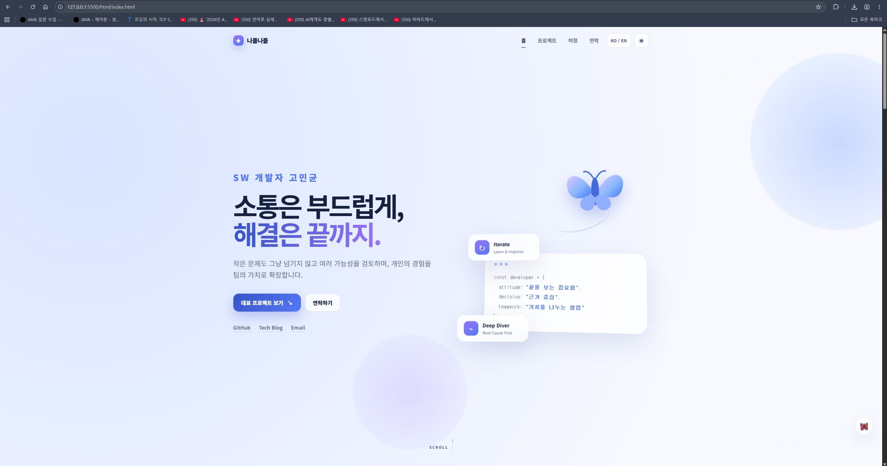

# 나폴나폴 서비스 기획서

 **"나비처럼 나의 매력을 나폴나폴 퍼트리는 개발자 고민균의 포트폴리오 페이지"**

<p align="start">
  <a href="#code-generation-prompt">🧩 제작 과정 및 프롬프트 설계 바로가기</a>
</p>

<p align="center">
  
</p>

<br>

## 1. 서비스 개요 📃

**나폴나폴**은 개발자 지원자의 역량과 프로젝트 경험을 채용 담당자가 짧은 시간 안에 이해할 수 있도록 구성한 개인 포트폴리오 페이지입니다.

단순히 경력과 기술을 나열하는 데 그치지 않고, 지원자가 어떤 문제를 발견했고 어떤 근거로 해결했으며 그 과정에서 팀에 어떤 가치를 남겼는지를 하나의 이야기 흐름으로 전달합니다.

| 항목 | 내용 |
|---|---|
| 서비스명 | 나폴나폴 |
| 서비스 유형 | 개발자 개인 포트폴리오 |
| 핵심 목적 | 지원자의 직무 적합성과 문제 해결 역량을 빠르고 명확하게 전달 |
| 주요 대상 | IT 기업 채용 담당자, 개발 직무 실무자, 협업 파트너 |
| 핵심 콘셉트 | 부드러운 소통과 집요한 문제 해결의 조화 |
| 한 줄 정의 | 나의 강점과 경험이 자연스럽게 퍼져 나가도록 설계한 개발자 포트폴리오 |

<br>

## 2. 기획 배경 🤔

채용 담당자는 한 명의 지원자에게 긴 시간을 사용하기 어렵습니다.  
포트폴리오에 많은 정보가 들어 있더라도 핵심이 빠르게 보이지 않으면 지원자의 역량이 충분히 전달되지 않을 수 있습니다.

기존 포트폴리오에서 자주 발생하는 문제는 다음과 같습니다.

- 첫 화면에서 희망 직무와 핵심 역량이 바로 보이지 않음
- 사용 기술만 나열되고 실제 문제 해결 과정은 드러나지 않음
- 프로젝트 정보가 복잡하게 흩어져 있어 읽는 흐름이 끊김
- 화려한 효과가 오히려 정보 확인을 방해함
- 취미나 부가 정보가 핵심 경력과 동일한 비중으로 노출됨
- 지원자의 성격과 협업 방식이 추상적인 표현에 머무름

나폴나폴은 이러한 문제를 해결하기 위해 **정보의 우선순위**, **일관된 이야기 구조**, **지원자의 실제 행동과 판단 근거**를 중심으로 기획되었습니다.

<br>

## 3. 문제 정의 ✏️

### 핵심 문제

> 채용 담당자는 제한된 시간 안에 지원자의 직무, 강점, 프로젝트 기여도를 확인해야 하지만, 일반적인 포트폴리오는 정보가 많고 구조가 복잡해 지원자의 차별점을 빠르게 파악하기 어렵습니다.

### 사용자의 불편

- 지원자가 어떤 직무를 원하는지 한눈에 알기 어려움
- 기술 스택과 실제 역량의 연결 관계가 보이지 않음
- 프로젝트에서 본인이 맡은 역할을 구분하기 어려움
- 결과만 제시되어 문제 해결 과정과 판단 근거를 알 수 없음
- 필요한 연락처와 외부 링크를 다시 찾아야 함
- 지나친 애니메이션과 버튼으로 탐색 피로가 발생함

<br>

## 4. 서비스 목표 🔍

### 핵심 목표

채용 담당자가 페이지에 들어온 뒤 **30초 이내에 다음 내용을 파악할 수 있도록 하는 것**을 목표로 합니다.

1. 지원자의 이름과 희망 직무
2. 지원자를 대표하는 핵심 역량
3. 가장 자신 있는 기술과 관심 분야
4. 대표 프로젝트와 기여 내용
5. 문제를 해결하는 방식
6. GitHub, 기술 블로그, 이메일

### 세부 목표

- 지원자의 강점을 추상적인 단어가 아닌 실제 경험으로 증명
- 프로젝트마다 동일한 설명 구조를 사용하여 비교와 이해를 쉽게 함
- 중요 정보는 바로 노출하고 부가 정보는 뒤로 배치
- 지원자의 개성을 보여주되 전문성과 신뢰감을 유지
- 모바일과 데스크톱 환경에서 모두 자연스럽게 읽히는 흐름 제공

<br>

## 5. 핵심 대상 ⭐

### 1차 대상

#### IT 기업 채용 담당자

- 많은 지원자의 자료를 짧은 시간 안에 검토함
- 지원 직무와 기본 역량을 가장 먼저 확인함
- 화려한 디자인보다 정보 전달력과 가독성을 중요하게 생각함

#### 개발 직무 실무자 및 면접관

- 사용 기술보다 실제 문제 해결 방식에 관심이 있음
- 지원자의 기술 선택 근거와 역할 범위를 확인하고 싶어 함
- 협업 과정에서 어떤 방식으로 기여했는지 알고 싶어 함

### 2차 대상

#### 프로젝트 협업자를 찾는 사람

- 지원자의 관심 분야와 기술 경험을 확인하고 싶어 함
- 협업 태도와 커뮤니케이션 방식을 알고 싶어 함
- GitHub와 기술 블로그를 통해 실제 활동을 확인하고 싶어 함

<br>

## 6. 브랜드 콘셉트 💡

### 나폴나폴의 의미

‘나폴나폴’은 나비가 가볍고 부드럽게 날아가는 모습을 표현하는 말입니다.

이 포트폴리오에서는 다음 두 가지 이미지를 함께 담습니다.

- **부드러운 유연함**  
  동료의 의견을 듣고 상황에 맞게 소통하며 함께 해결책을 찾는 태도

- **집요한 책임감**  
  작은 문제도 그냥 넘기지 않고 근본 원인을 찾을 때까지 몰입하는 태도

### 핵심 메시지

> 부드럽게 소통하지만 문제 앞에서는 쉽게 물러서지 않는 개발자

### 메인 캐치프레이즈

> **작은 문제도 그냥 넘기지 않고 여러 가능성을 검토하며, 팀의 가치를 나폴나폴 퍼트리는 몰입형 개발자 고민균입니다.**

<br>

## 7. 핵심 가치 🗝️

### 1. 끝을 보는 집요함

문제가 발생했을 때 임시방편으로 덮지 않고 원인을 끝까지 추적합니다.

포트폴리오에서는 단순히 “기능을 구현했다”라고 설명하지 않고 다음 내용을 보여줍니다.

- 어떤 문제가 발생했는가
- 문제의 원인은 무엇이었는가
- 어떤 방식으로 원인을 추적했는가
- 해결 후 무엇이 달라졌는가

### 2. 근거 중심의 판단

기술과 구현 방식을 선택할 때 유행이나 선호만 따르지 않고 여러 대안을 비교합니다.

포트폴리오에서는 다음을 중심으로 설명합니다.

- 왜 이 기술이 필요했는가
- 다른 대안은 무엇이었는가
- 프로젝트의 조건은 무엇이었는가
- 최종 선택의 근거는 무엇이었는가

### 3. 가치를 나누는 협업

개인의 경험을 개인에게만 남기지 않고 팀의 자산으로 확장합니다.

다음과 같은 경험을 통해 협업 역량을 보여줍니다.

- 트러블슈팅 기록
- 팀 위키와 문서 작성
- 기술 블로그 공유
- 코드 리뷰와 피드백
- 반복 업무 개선
- 공통 규칙과 가이드 제안

<br>

## 8. 핵심 역량 키워드 🪄

| 키워드 | 의미 |
|---|---|
| **Deep Diver** | 문제의 표면이 아닌 근본 원인까지 파고드는 몰입력 |
| **Iterate** | 한 번의 결과에 만족하지 않고 반복적으로 점검하고 개선하는 태도 |
| **Reason First** | 느낌보다 논리와 근거를 바탕으로 판단하는 능력 |
| **Sincere Pioneer** | 발견한 문제를 직접 개선하고 기록으로 남기는 실행력 |

이 네 가지 키워드는 단독으로 제시하는 것이 아니라 실제 프로젝트 사례와 연결하여 증명합니다.

<br>

## 9. 핵심 제공 가치 📘

### 채용 담당자에게

- 지원자의 직무와 강점을 빠르게 파악할 수 있음
- 대표 프로젝트의 핵심만 짧은 시간 안에 확인할 수 있음
- 지원자의 기술 선택 방식과 문제 해결 태도를 이해할 수 있음
- GitHub, 블로그, 이메일로 즉시 이동할 수 있음

### 지원자에게

- 경력과 기술을 단순 나열하지 않고 하나의 이야기로 보여줄 수 있음
- 프로젝트의 기여도와 문제 해결 능력을 명확하게 표현할 수 있음
- 자신만의 개발 태도와 협업 방식을 일관되게 전달할 수 있음
- ‘나폴나폴’이라는 기억하기 쉬운 이름으로 개인 브랜드를 만들 수 있음

<br>

## 10. 콘텐츠 구성 💿

### 10.1 첫인상 영역

페이지에 들어온 사용자가 가장 먼저 확인하는 영역입니다.

#### 보여줄 정보

- 이름
- 희망 직무
- 캐치프레이즈
- 한 줄 소개
- 핵심 역량
- 주요 기술
- GitHub
- 기술 블로그
- 이메일

#### 목적

> 지원자가 누구이며 어떤 개발자인지를 별도의 탐색 없이 바로 전달합니다.

### 10.2 핵심 역량 요약

지원자의 강점과 기술을 한눈에 보여주는 영역입니다.

#### 보여줄 정보

- 4대 핵심 역량
- 가장 자신 있는 기술
- 관심 분야
- 강점을 설명하는 짧은 문장

#### 목적

채용 담당자가 지원자의 특징과 직무 적합성을 빠르게 스캔하도록 돕습니다.

### 10.3 대표 프로젝트

포트폴리오에서 가장 중요한 영역입니다.

대표 프로젝트는 많은 수를 나열하기보다 지원자의 강점을 잘 보여주는 프로젝트를 우선적으로 선정합니다.

#### 프로젝트별 구성

1. 프로젝트 소개
2. 해결하려고 한 문제
3. 본인의 역할
4. 해결 과정
5. 기술 선택 이유
6. 결과와 성과
7. 배운 점
8. GitHub 또는 배포 링크

#### 설명 방식

각 프로젝트는 다음과 같은 동일한 이야기 구조로 전달합니다.

> **문제 정의 → 원인 분석과 대안 검토 → 해결 과정 → 결과와 배운 점**

이를 통해 채용 담당자가 프로젝트마다 지원자의 판단과 기여를 쉽게 비교할 수 있도록 합니다.

### 10.4 경력 및 활동

경력, 교육, 대외활동, 수상 정보를 시간의 흐름에 따라 정리합니다.

#### 보여줄 정보

- 활동 기간
- 기관 또는 소속
- 역할
- 수행 내용
- 핵심 성과

#### 목적

지원자가 어떤 경험을 거쳐 현재의 역량을 갖추게 되었는지 보여줍니다.

### 10.5 더 알아보기

지원자의 성격, 가치관, 취미처럼 직무 판단의 우선순위가 낮은 정보를 제공하는 영역입니다.

#### 포함 가능한 내용

- 협업 가치관
- 개발자로서 중요하게 생각하는 태도
- 취미와 관심 분야
- 네트워킹 활동
- 학습 습관

#### 목적

핵심 정보의 흐름은 방해하지 않으면서 지원자의 인간적인 면과 조직 적합성을 전달합니다.

### 10.6 연락 영역

페이지를 확인한 사용자가 자연스럽게 다음 행동을 할 수 있도록 안내합니다.

#### 제공 정보

- 이메일
- GitHub
- 기술 블로그
- 마무리 메시지

#### 목적

관심을 가진 채용 담당자나 협업자가 추가 탐색 또는 연락으로 쉽게 이어질 수 있도록 합니다.

<br>

## 11. 사용자 경험 흐름 🗂️

```text
지원자의 이름과 직무 확인
        ↓
핵심 역량과 기술 확인
        ↓
대표 프로젝트를 통해 역량 검증
        ↓
경력과 활동 이력 확인
        ↓
가치관과 부가 정보 확인
        ↓
GitHub·블로그 방문 또는 이메일 연락
```

페이지는 한 방향으로 자연스럽게 내려가며 읽을 수 있도록 구성하고, 핵심 정보를 확인하기 위해 여러 페이지를 오가거나 버튼을 반복해서 누르지 않도록 합니다.

<br>

## 12. 서비스의 차별점 🛠️

### 1. 기술보다 문제 해결 과정을 보여주는 포트폴리오

사용 기술 목록보다 문제를 발견하고 해결한 과정을 중심에 둡니다.

### 2. 지원자의 강점을 프로젝트 구조와 연결

Deep Diver, Iterate, Reason First, Sincere Pioneer라는 역량이 단순 문구로 끝나지 않고 실제 경험에서 드러나도록 합니다.

### 3. 부드러움과 집요함을 함께 보여주는 개인 브랜드

일반적인 개발자 포트폴리오의 딱딱한 이미지를 완화하면서도 전문성과 신뢰감을 유지합니다.

### 4. 채용 담당자의 검토 흐름에 맞춘 정보 배치

지원자의 관점이 아니라 채용 담당자가 확인하고 싶은 순서에 맞춰 정보를 배치합니다.

### 5. 핵심과 부가 정보의 명확한 구분

프로젝트, 역량, 경력은 바로 보여주고 취미나 성격은 필요할 때만 확인하도록 분리합니다.

<br>

## 13. 디자인 방향 💄

### 무드와 톤

- 편안한
- 유연한
- 정돈된
- 신뢰감 있는

### 시각적 방향

- 밝은 배경과 넓은 여백을 사용하여 편안한 인상 제공
- 블루 계열을 중심으로 전문성과 신뢰감 표현
- 제목은 묵직하게, 본문은 부담 없이 읽히도록 구성
- 나비와 바람의 이미지는 첫인상을 보조하는 수준으로만 사용
- 아동용 또는 캐릭터 중심의 디자인처럼 보이지 않도록 절제
- 프로젝트와 성과가 가장 강하게 보이도록 정보의 강약 조절

<br>

## 14. 반드시 지켜야 할 원칙 🚫

### 1. 여백을 충분히 확보한다

정보를 빽빽하게 채우지 않고 섹션과 문장 사이에 충분한 간격을 둡니다.

### 2. 중요한 정보만 강조한다

이름, 희망 직무, 문제 원인, 해결 과정, 최종 성과처럼 실제 판단에 필요한 정보만 강조합니다.

### 3. 장식보다 내용을 우선한다

나비와 바람의 콘셉트는 지원자의 이미지를 기억하게 만드는 보조 수단으로만 사용합니다.

### 4. 핵심 정보는 숨기지 않는다

프로젝트와 역량을 별도의 버튼이나 팝업 안에 숨기지 않고 바로 보여줍니다.

### 5. 확인되지 않은 정보는 만들지 않는다

실제 경험, 기술, 성과, 수치만 사용하며 불명확한 내용은 추후 작성 영역으로 남깁니다.

<br>

## 15. 초기 공개 범위 🚀

첫 번째 버전에서는 다음 내용을 우선 완성합니다.

- 이름과 희망 직무
- 캐치프레이즈와 한 줄 소개
- 핵심 역량 4개
- 주요 기술과 관심 분야
- 대표 프로젝트 2개
- 경력·교육·활동·수상 이력
- GitHub, 기술 블로그, 이메일
- 협업 가치관과 간단한 자기소개

취미, 상세 기술 아카이브, 모든 프로젝트, 긴 회고 등은 핵심 정보가 완성된 뒤 추가합니다.

<br>

## 16. 기대 효과 🪄

- 채용 담당자가 지원자의 직무와 역량을 빠르게 이해할 수 있습니다.
- 프로젝트를 통해 지원자의 문제 해결 방식과 판단 근거를 확인할 수 있습니다.
- 지원자의 유연한 협업 태도와 집요한 실행력을 함께 전달할 수 있습니다.
- 지원자 개인의 경험이 일관된 브랜드 메시지로 정리됩니다.
- GitHub, 블로그, 이메일로 자연스럽게 추가 행동이 이어집니다.

<br>

## 17. 제작 과정 및 프롬프트 설계 🧩

나폴나폴 포트폴리오는 AI에게 곧바로 웹페이지 제작을 요청하는 방식이 아니라, **기획 단계와 구현 단계를 분리하는 방식**으로 제작하였습니다.

먼저 채용 담당자의 관점에서 포트폴리오의 핵심 콘셉트, 정보 우선순위, 사용자 흐름, 디자인 방향을 결정하였습니다.

이후 완성된 기획서를 코드 생성 프롬프트에 그대로 전달하여, 이미 결정된 내용을 HTML, CSS, JavaScript로 구현하도록 하였습니다.

```text
기획 프롬프트 작성
        ↓
AI와 항목별 질의응답
        ↓
포트폴리오 기획서 완성
        ↓
완성된 기획서를 코드 생성 프롬프트에 입력
        ↓
HTML·CSS·JavaScript 초안 제작
        ↓
미리보기 및 기능 확인
        ↓
한 가지 항목씩 수정
        ↓
최종 포트폴리오 완성
```

이러한 과정을 통해 AI가 임의로 새로운 콘셉트를 추가하거나 실제와 다른 경력과 프로젝트를 만들어내는 것을 방지하고, 기획 의도가 웹페이지에 일관되게 반영되도록 하였습니다.

### 17.1 프롬프트 작성 원칙

#### 1. 역할을 구체적으로 지정

AI가 어떤 관점으로 결과를 만들어야 하는지 명확히 하기 위해 페르소나를 설정하였습니다.

기획 단계에서는 개발자 지원자의 포트폴리오를 검토하는 **IT 기업 채용 담당자이자 UI/UX 전문가**의 관점으로 판단하도록 하였습니다.

구현 단계에서는 **바닐라 HTML, CSS, JavaScript 기반의 프론트엔드 개발자**로 역할을 제한하여 React나 Vue 등의 프레임워크를 임의로 사용하지 않도록 하였습니다.

#### 2. 기획과 구현을 분리

처음부터 코드를 생성하면 디자인이나 정보 구조가 충분히 정리되지 않은 상태에서 결과물이 만들어질 수 있습니다.

이를 방지하기 위해 다음 두 단계로 프롬프트를 분리하였습니다.

- 1단계: 포트폴리오 콘셉트와 정보 구조 결정
- 2단계: 확정된 기획서를 기반으로 웹페이지 구현

코드 생성 단계에서는 새로운 콘셉트를 다시 제안하지 않고, 기획서에서 결정한 내용을 구현하는 데 집중하도록 지시하였습니다.

#### 3. 질문을 한 항목씩 진행

포트폴리오의 이미지, 캐치프레이즈, 핵심 역량, 타깃, 사용자 흐름 등을 한 번에 결정하지 않고 한 항목씩 질문하도록 설정하였습니다.

사용자의 답변이 추상적인 경우에는 AI가 2~3개의 구체적인 방향을 예시로 제시하도록 하였습니다.

단, 사용자가 말하지 않은 성향이나 경험을 임의로 만들어내지 않도록 제한하였습니다.

#### 4. 제약 조건을 명확하게 작성

결과물이 목적에서 벗어나지 않도록 다음 사항을 구체적으로 명시하였습니다.

- 실제로 제공하지 않은 경력과 프로젝트를 생성하지 않기
- 핵심 정보를 버튼이나 팝업 안에 숨기지 않기
- 과도한 애니메이션과 인터랙션 사용하지 않기
- 외부 프레임워크와 JavaScript 라이브러리 사용하지 않기
- 이미지와 폰트는 라이선스가 확인된 무료 리소스만 사용하기
- 모바일, 태블릿, 데스크톱에서 사용할 수 있도록 반응형으로 구현하기
- 접근성을 위해 시맨틱 태그, alt 속성, focus 상태 적용하기

<br>

## 18. 기획 프롬프트 📝

기획 프롬프트는 포트폴리오의 전체 콘셉트와 정보 구조를 결정하기 위해 사용하였습니다.

AI가 결과를 한 번에 결정하는 것이 아니라, 사용자에게 항목별로 질문하면서 포트폴리오의 방향을 구체화하도록 설계하였습니다.

```text
[페르소나]

너는 지금 IT 기업의 채용 담당자이자 UI/UX도 과하게 집착하는 전문가야.

개발자 지원자의 포트폴리오를 평가하는 관점에서, 채용에 도움이 되는 포트폴리오 콘셉트와 구성, 디자인을 어떤 식으로 하면 좋을지 조언해줘.

코드는 아직 쓰지 마.


[정보]

- 소개 대상: 나 자신의 포트폴리오
- 들어갈 내용: 자기소개, 강점 키워드, 경력 및 수상, 프로젝트, 기타
- 신경 써야 할 부분:
  - 채용 담당자는 여러 사람을 검사해야 하므로 가독성이 좋아야 함
  - 흐름도 단순하게 한 방향으로 잘 읽혀야 함
  - 너무 많은 버튼은 사용하지 않는 것이 좋음
  - 기타 내용, 성격, 취미처럼 중요도가 낮은 정보는 버튼을 눌러 확인할 수 있도록 구성할 수 있음
  - 전체 구성이 복잡하지 않고 일관되어야 함
  - 이름과 희망 직무를 어필하는 문구가 필요함
  - 나를 소개하는 한 줄 문장이 필요함
  - GitHub, 블로그, 이메일로 이동할 수 있어야 함


[요청]

내 포트폴리오의 전체 콘셉트와 디자인 방향을 정할 수 있도록 아래 항목을 순서대로 진행해줘.

1. 포트폴리오에서 가장 강조하고 싶은 이미지와 역량
2. 캐치프레이즈 후보 3개
3. 채용 담당자에게 보여줄 매력 포인트 3~5개
4. 핵심 타깃 방문자와 타깃이 가장 먼저 확인할 정보
5. 첫 화면부터 프로젝트까지 이어지는 스토리텔링 흐름
6. 포트폴리오의 무드와 톤을 나타내는 형용사 4개
7. 콘셉트에 어울리는 메인 컬러, 보조 컬러, 폰트 조합

한 번에 모든 내용을 제안하지 말고, 한 항목씩 질문해줘.

내 답변이 추상적이거나 포트폴리오 방향을 정하기에 부족하면 구체적인 예시를 제시하면서 추가 질문을 해줘.

각 질문에서는 선택하기 쉽도록 2~3개의 방향을 예시로 보여주되, 내가 말하지 않은 경력이나 성향을 임의로 만들어내지는 마.


[최종 결과물]

모든 질문이 끝나면 다음 항목을 표로 정리해줘.

- 항목
- 최종 결정 내용
- 선정 이유
- 실제 포트폴리오 적용 방법

마지막에는 전체 내용을 바탕으로 다음 결과물도 만들어줘.

- 포트폴리오 콘셉트를 설명하는 한 문장
- 메인 화면에 들어갈 이름·희망 직무·한 줄 소개 문구
- 추천 섹션 배치 순서
- 전체 디자인에서 반드시 지켜야 할 원칙 3가지

채용 담당자가 짧은 시간 안에 지원자의 직무와 강점을 이해하는 것을 가장 우선으로 고려해줘.

화려한 인터랙션이나 독특함을 억지로 추가하기보다는 가독성, 일관성, 정보의 우선순위를 중심으로 판단해줘.
```

### 18.1 기획 프롬프트를 통해 결정한 내용

| 항목 | 최종 결정 내용 |
|---|---|
| 포트폴리오 이름 | 나폴나폴 |
| 핵심 이미지 | 부드럽게 소통하지만 문제 해결에는 집요한 개발자 |
| 브랜드 메시지 | 팀의 가치를 나폴나폴 퍼트리는 개발자 |
| 핵심 역량 | Deep Diver, Iterate, Reason First, Sincere Pioneer |
| 주요 대상 | IT 기업 채용 담당자와 개발 직무 면접관 |
| 정보 구조 | 이름과 직무 → 핵심 역량 → 프로젝트 → 경력과 활동 → 부가 정보 → 연락 |
| 무드와 톤 | 편안한, 유연한, 정돈된, 신뢰감 있는 |
| 디자인 방향 | 밝은 배경, 충분한 여백, 블루 계열 중심, 절제된 나비 모티프 |
| 핵심 원칙 | 가독성, 정보 우선순위, 디자인 일관성 |

<br>


---
---


## 19. 코드 생성 프롬프트 💻

코드 생성 프롬프트는 앞 단계에서 완성한 기획서를 실제 웹페이지로 구현하기 위해 사용하였습니다.

새로운 디자인이나 콘텐츠를 다시 제안하지 않고, 기획서에서 결정한 내용을 바닐라 HTML, CSS, JavaScript로 구현하도록 역할과 범위를 제한하였습니다.

```text
[페르소나]

너는 바닐라 HTML/CSS/JS 기반의 프론트엔드 개발자이자 포트폴리오 웹사이트 구현 전문가야.

React, Vue 등의 프레임워크와 별도의 빌드 도구는 사용하지 말고, HTML/CSS/JS만으로 실행 가능한 웹사이트를 만들어줘.

너의 역할은 새로운 포트폴리오 콘셉트나 디자인 방향을 다시 제안하는 것이 아니라, 아래 기획서에서 이미 결정된 내용을 정확하게 해석하여 실제 웹페이지로 구현하는 것이야.


[구현 목표]

위 기획서를 기반으로 IT 기업의 채용 담당자가 짧은 시간 안에 지원자의 희망 직무, 핵심 역량, 프로젝트 경험을 이해할 수 있는 1페이지 포트폴리오 웹사이트를 만들어줘.

기획서에서 정한 포트폴리오 콘셉트, 캐치프레이즈, 스토리텔링 흐름, 무드와 톤, 컬러, 폰트, 섹션 순서를 우선적으로 적용해줘.

기획서에 없는 경력, 프로젝트, 기술 스택, 수치, 성과, 연락처 등의 정보는 임의로 만들어내지 말고, 필요한 부분은 수정하기 쉬운 플레이스홀더로 표시해줘.


[핵심 구현 원칙]

1. 정보 전달력

- 첫 화면에서 이름, 희망 직무, 한 줄 소개 문구가 바로 보이도록 구성해줘.
- 채용 담당자가 지원자의 직무와 핵심 강점을 빠르게 파악할 수 있어야 해.
- 중요도가 높은 정보를 위쪽에 배치하고, 아래로 자연스럽게 읽히는 흐름을 만들어줘.
- 장식보다 정보의 우선순위와 가독성을 중요하게 고려해줘.


2. 디자인 일관성

- 기획서에서 정의한 무드, 톤, 메인 컬러, 보조 컬러, 폰트 방향을 유지해줘.
- 모든 섹션이 하나의 일관된 브랜드 경험처럼 느껴지도록 구성해줘.
- 나비와 나폴나폴이라는 콘셉트는 은은하게 활용하되, 유치하거나 지나치게 장식적으로 보이지 않게 해줘.
- 과한 애니메이션, 복잡한 인터랙션, 불필요한 버튼은 사용하지 말아줘.


3. 사용자 경험

- 채용 담당자가 별도의 설명 없이도 자연스럽게 아래로 읽을 수 있는 단방향 구조로 만들어줘.
- 핵심 정보는 버튼을 누르지 않아도 바로 확인할 수 있게 해줘.
- 취미, 성격, 기타 정보처럼 중요도가 낮은 내용만 접기·펼치기 또는 보조 버튼으로 제공할 수 있어.
- GitHub, 블로그, 이메일 링크는 첫 화면이나 쉽게 찾을 수 있는 위치에 배치해줘.


[페이지 구조]

기본적으로 다음 구조를 사용하되, 기획서에서 정한 추천 섹션 배치 순서가 있다면 기획서를 우선 적용해줘.

1. Hero Section

- 이름
- 희망 직무
- 캐치프레이즈
- 한 줄 자기소개
- 핵심 역량 요약
- GitHub / Blog / Email 링크
- 포트폴리오 콘셉트를 보여주는 시각 요소


2. About Section

- 자기소개
- 개발자로서 중요하게 생각하는 가치
- 지원자의 방향성과 관심 분야


3. Strength Section

- 핵심 강점 키워드 3~5개
- 강점에 대한 짧은 설명
- 한눈에 비교할 수 있는 카드 형태


4. Experience Section

- 경력
- 활동
- 교육
- 수상 내역

정보가 없다면 임의로 작성하지 말고, 수정 가능한 예시 영역으로 만들어줘.


5. Project Section

각 프로젝트는 다음 정보가 잘 드러나도록 구성해줘.

- 프로젝트명
- 프로젝트 한 줄 설명
- 프로젝트 기간
- 역할
- 사용 기술
- 해결하려고 한 문제
- 해결 과정
- 주요 기능
- 결과 또는 성과
- 배운 점
- GitHub 또는 배포 링크

프로젝트가 여러 개일 경우 카드 또는 세로형 목록으로 정리하되, 정보가 지나치게 숨겨지지 않도록 해줘.


6. Other Section

- 자격증
- 기타 활동
- 취미
- 성격
- 부가 정보

이 섹션은 핵심 정보보다 시각적 중요도를 낮게 설정하고, 필요하면 접기·펼치기 형태로 구현해줘.


7. Footer

- 이메일
- GitHub
- 블로그
- 마무리 문구
- 저작권 표시


[디자인 요구사항]

- 데스크톱, 태블릿, 모바일에서 모두 자연스럽게 보이는 반응형 웹으로 만들어줘.
- 텍스트의 제목, 본문, 보조 정보 계층이 명확하게 구분되도록 해줘.
- 충분한 여백을 활용하여 답답하지 않게 구성해줘.
- 프로젝트와 핵심 역량이 가장 잘 보이도록 시각적 강조 순서를 조절해줘.
- 너무 많은 색을 사용하지 말고, 기획서에서 정한 컬러 조합을 중심으로 사용해줘.
- 나비 모티프는 배경 패턴, 작은 아이콘, 곡선, 가벼운 움직임 등으로 제한적으로 활용해줘.
- 가독성을 해칠 수 있는 필기체나 장식적인 폰트는 핵심 본문에 사용하지 말아줘.
- 버튼과 링크에는 hover 및 focus 상태를 적용해줘.
- 키보드만으로도 주요 링크와 버튼에 접근할 수 있도록 해줘.
- 이미지에는 alt 속성을 적용해줘.


[인터랙션 요구사항]

인터랙션은 포트폴리오 탐색을 방해하지 않는 범위에서만 사용해줘.

사용 가능한 인터랙션 예시:

- 스크롤 시 섹션이 부드럽게 나타나는 효과
- 내비게이션 클릭 시 해당 섹션으로 부드럽게 이동
- 프로젝트 카드 hover 효과
- 낮은 중요도의 기타 정보 접기·펼치기
- 나비 또는 곡선 요소의 매우 약한 움직임

다음 인터랙션은 사용하지 말아줘.

- 지나치게 긴 로딩 화면
- 마우스 커서를 따라다니는 복잡한 효과
- 정보를 가리는 애니메이션
- 자동 재생되는 큰 영상
- 의미 없는 팝업
- 모든 정보를 모달이나 버튼 안에 숨기는 방식


[코드 작성 방식]

- index.html, style.css, script.js로 분리해서 작성해줘.
- 외부 프레임워크와 JavaScript 라이브러리는 사용하지 말아줘.
- HTML은 시맨틱 태그를 사용해줘.
- CSS에는 색상, 폰트, 간격을 관리할 수 있도록 :root에 CSS 변수를 정의해줘.
- 클래스명은 역할을 쉽게 이해할 수 있도록 작성해줘.
- 반복되는 스타일은 재사용할 수 있게 구성해줘.
- JavaScript는 꼭 필요한 인터랙션에만 사용해줘.
- 코드에는 각 섹션과 주요 기능을 구분할 수 있는 간단한 주석을 작성해줘.
- 사용자가 나중에 텍스트, 색상, 프로젝트 정보를 쉽게 수정할 수 있도록 구조화해줘.


[무료 리소스 사용 기준]

- 이미지와 폰트가 필요한 경우 출처가 명확하고 상업적 이용이 가능한 무료 리소스만 사용해줘.
- 외부 이미지를 임의로 연결하지 말고, 사용할 경우 출처와 라이선스를 함께 설명해줘.
- 출처가 불분명한 리소스는 사용하지 말아줘.
- 실제 프로필 사진이나 프로젝트 이미지가 없으면 임의의 인물 사진을 넣지 말고 플레이스홀더를 사용해줘.


[출력 형식]

다음 순서로 답변해줘.

1. 기획서를 웹사이트에 어떻게 반영했는지 간단히 설명
2. 전체 페이지 구조
3. index.html 전체 코드
4. style.css 전체 코드
5. script.js 전체 코드
6. 실행 방법
7. 사용자가 직접 교체해야 하는 텍스트, 링크, 이미지 목록

Canvas에서 바로 실행하고 미리보기 할 수 있도록 완전한 형태의 코드를 제공해줘.

우선 전체 레이아웃과 정보 구조가 정상적으로 작동하는 버전을 완성해줘.

세부 색상, 간격, 애니메이션은 이후 요청에 따라 하나씩 수정할 수 있도록 구현해줘.
```

<br>

## 20. 프롬프트 적용 예시: SSAFY 소개 페이지 만들기 🧪

포트폴리오 제작 전에 동일한 프롬프트 구조가 실제 웹페이지 생성에도 효과적으로 적용되는지 확인하기 위해 SSAFY 소개 페이지를 예시로 제작하였습니다.

이 과정에서는 프롬프트의 주제와 콘텐츠만 SSAFY 소개로 변경하고, 역할 지정, 구현 원칙, 페이지 구조, 디자인 요구사항, 출력 형식은 동일하게 유지하였습니다.

### 20.1 입력 정보 예시

```text
[소개 대상]

삼성 청년 SW·AI 아카데미 SSAFY


[페이지 목적]

SSAFY를 처음 접하는 사용자가 교육 과정의 특징, 지원 대상, 교육 내용, 지원 혜택을 쉽게 이해할 수 있는 소개 페이지 제작


[핵심 정보]

- SSAFY 소개
- 교육 대상
- 교육 과정
- 교육 특징
- 지원 혜택
- 모집 절차
- 공식 홈페이지 이동 링크


[구현 조건]

- HTML, CSS, JavaScript만 사용
- 한 페이지 구조
- 핵심 정보가 위에서 아래로 자연스럽게 연결되도록 구성
- 지나치게 많은 버튼과 인터랙션 사용 금지
- 모바일과 데스크톱 반응형 지원
- 확인되지 않은 모집 일정과 수치는 임의로 작성하지 않기
```

### 20.2 예시 제작 목적

- 프롬프트의 역할과 제약 조건이 실제 결과에 반영되는지 확인
- 정보의 중요도에 따라 섹션이 배치되는지 확인
- 한 페이지 구조의 가독성과 사용자 흐름 확인
- HTML, CSS, JavaScript 파일이 정상적으로 분리되는지 확인
- 수정 요청을 한 항목씩 적용할 수 있는 구조인지 확인

SSAFY 소개 페이지 제작을 통해 기본 프롬프트 구조를 검증한 뒤, 같은 방식을 개인 포트폴리오인 나폴나폴에 적용하였습니다.

### 20.3 결과 화면



<br>

## 21. 수정 및 개선 방식 🔧

초기 코드를 생성한 이후에는 전체 코드를 반복해서 새로 생성하지 않고, 수정할 항목을 하나씩 지정하여 개선하였습니다.

예를 들어 색상, 간격, 메뉴, 프로젝트 카드, 모바일 레이아웃을 각각 분리하여 수정함으로써 이미 완성된 기능이나 디자인이 의도하지 않게 변경되는 것을 줄였습니다.

### 21.1 수정 요청 작성 예시

```text
현재 작성된 index.html, style.css, script.js의 전체 구조는 유지해줘.

이번에는 모바일 내비게이션 메뉴만 수정해줘.

[수정할 파일]

- script.js
- 필요한 경우 style.css의 모바일 메뉴 관련 부분


[변경 내용]

- 메뉴 버튼을 누르면 내비게이션이 열리고 닫히도록 구현
- 메뉴 링크를 누르면 메뉴가 자동으로 닫히도록 구현
- Escape 키를 누르면 메뉴가 닫히도록 구현
- 메뉴가 열렸을 때 aria-expanded 값을 true로 변경
- 기존 프로젝트 카드와 다른 섹션의 스타일은 변경하지 않기

수정된 파일의 전체 코드를 제공해줘.
```

### 21.2 수정 과정에서 지킨 원칙

- 수정 요청은 한 번에 한 가지씩 진행
- 수정 대상 파일과 영역을 명확하게 지정
- 변경하면 안 되는 섹션과 기능을 함께 명시
- 수정 후 기존 레이아웃과 기능이 유지되는지 전체 확인
- 부분 코드만 수정한 경우에도 전체 코드와의 연결 관계 확인
- 실제 경력이나 프로젝트 내용을 AI가 임의로 생성하지 않도록 제한
- 이미지와 폰트는 라이선스와 출처가 명확한 무료 리소스만 사용
- 데스크톱과 모바일 환경을 모두 확인
- 기존 링크, 메뉴, 버튼, 애니메이션이 유지되는지 확인
- 브라우저 콘솔에서 JavaScript 오류가 발생하지 않는지 확인

<br>

## 22. 최종 점검 체크리스트 ✅

### 22.1 기획 확인

- [ ] 첫 화면에서 이름과 희망 직무가 바로 보이는가?
- [ ] 한 줄 소개만 읽어도 어떤 개발자인지 이해할 수 있는가?
- [ ] 핵심 역량이 실제 프로젝트 경험과 연결되어 있는가?
- [ ] 프로젝트가 문제, 해결 과정, 결과 순서로 설명되어 있는가?
- [ ] 중요 정보와 부가 정보의 시각적 우선순위가 구분되어 있는가?
- [ ] GitHub, 기술 블로그, 이메일을 쉽게 찾을 수 있는가?
- [ ] 채용 담당자가 30초 안에 핵심 정보를 파악할 수 있는가?

### 22.2 콘텐츠 확인

- [ ] AI가 임의로 생성한 경력이나 프로젝트가 포함되지 않았는가?
- [ ] 프로젝트에서 본인의 역할과 팀의 역할이 구분되어 있는가?
- [ ] 기술 스택이 단순 나열되지 않고 사용 이유와 연결되어 있는가?
- [ ] 성과 수치와 결과에 확인 가능한 근거가 있는가?
- [ ] 플레이스홀더가 실제 정보로 모두 교체되었는가?
- [ ] 오탈자와 링크 오류가 없는가?
- [ ] 현재 사용하지 않는 임시 문구가 남아 있지 않은가?

### 22.3 디자인 확인

- [ ] 나폴나폴의 무드와 컬러가 모든 섹션에서 일관되게 적용되었는가?
- [ ] 나비 모티프가 지나치게 유치하거나 장식적으로 보이지 않는가?
- [ ] 프로젝트와 핵심 역량이 다른 정보보다 잘 보이는가?
- [ ] 제목, 본문, 보조 정보의 크기와 굵기가 구분되는가?
- [ ] 문장과 섹션 사이에 충분한 여백이 있는가?
- [ ] 사용된 색상이 지나치게 많지 않은가?
- [ ] 작은 글자나 낮은 명암으로 가독성이 떨어지는 부분이 없는가?

### 22.4 기능 확인

- [ ] 내비게이션을 누르면 정확한 섹션으로 이동하는가?
- [ ] 모바일 메뉴가 정상적으로 열리고 닫히는가?
- [ ] GitHub, 블로그, 이메일 링크가 정상적으로 작동하는가?
- [ ] 이메일 복사 기능과 안내 메시지가 정상적으로 작동하는가?
- [ ] 기타 정보의 접기·펼치기 기능이 정상적으로 작동하는가?
- [ ] 맨 위로 이동 버튼이 정상적으로 작동하는가?
- [ ] JavaScript 오류가 브라우저 콘솔에 나타나지 않는가?

### 22.5 반응형 확인

- [ ] 데스크톱 화면에서 콘텐츠가 지나치게 넓게 퍼지지 않는가?
- [ ] 태블릿 화면에서 카드와 텍스트가 자연스럽게 배치되는가?
- [ ] 모바일 화면에서 가로 스크롤이 발생하지 않는가?
- [ ] 모바일에서 버튼과 링크를 손가락으로 쉽게 누를 수 있는가?
- [ ] 프로젝트 카드의 텍스트가 잘리거나 겹치지 않는가?
- [ ] 모바일 메뉴가 화면을 벗어나지 않는가?

### 22.6 접근성 확인

- [ ] 모든 이미지에 내용을 설명하는 alt 속성이 있는가?
- [ ] 키보드의 Tab 키로 링크와 버튼에 접근할 수 있는가?
- [ ] 현재 포커스된 요소가 시각적으로 표시되는가?
- [ ] 버튼에 기능을 설명하는 aria-label이 적용되어 있는가?
- [ ] 모바일 메뉴의 열림 상태가 aria-expanded에 반영되는가?
- [ ] 색상만으로 정보나 상태를 구분하지 않는가?
- [ ] 애니메이션 감소 설정을 고려하였는가?

### 22.7 리소스 및 배포 확인

- [ ] 사용한 이미지의 출처와 라이선스를 확인하였는가?
- [ ] 사용한 폰트가 무료로 사용 가능한 폰트인가?
- [ ] 사용하지 않는 이미지와 코드가 제거되었는가?
- [ ] 파일명과 이미지 경로의 대소문자가 일치하는가?
- [ ] index.html, style.css, script.js의 연결 경로가 정확한가?
- [ ] 배포 환경에서도 이미지와 폰트가 정상적으로 표시되는가?
- [ ] 데스크톱과 모바일 브라우저에서 최종 페이지를 확인하였는가?

<br>

## 23. 프롬프트 활용 결과 📌

기획과 구현을 분리한 프롬프트 작성 방식을 통해 다음과 같은 효과를 얻었습니다.

- 포트폴리오 제작 전에 핵심 콘셉트와 정보 구조를 먼저 결정할 수 있었습니다.
- 채용 담당자의 관점에서 정보의 우선순위를 정리할 수 있었습니다.
- AI가 실제와 다른 경력이나 프로젝트를 임의로 생성하는 것을 줄일 수 있었습니다.
- 기획서와 실제 웹페이지 사이의 디자인 및 콘텐츠 일관성을 유지할 수 있었습니다.
- 수정 요청을 기능별로 분리하여 기존 레이아웃이 무너지는 문제를 줄일 수 있었습니다.
- AI를 단순한 코드 생성 도구가 아니라 기획과 구현 과정을 보조하는 도구로 활용할 수 있었습니다.
- 프롬프트를 통해 요구사항, 제한 조건, 출력 형식을 명확하게 전달하는 경험을 얻을 수 있었습니다.
